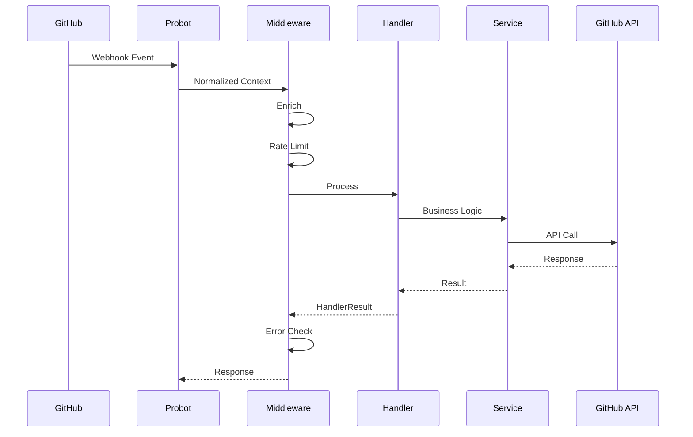

# GitHub Events

All webhook events GitBuddy Bot subscribes to and how they map to domain handlers.

## Event → Handler Mapping

| GitHub Event | Handler | Action |
|-------------|---------|--------|
| `issues.opened` | Automation | Apply default labels |
| `issues.opened` | Security | Scan for secrets |
| `issues.opened` | Copilot | Suggest labels (if enabled) |
| `issue_comment.created` | Command Router | Route to slash command |
| `pull_request.opened` | Automation | Enforce PR checklist |
| `pull_request.opened` | Copilot | Generate description / review |
| `push` | Security | Scan commits for secrets |
| `push` | Sync | Propagate changes downstream |
| `repository.created` | Governance | Bootstrap required files |
| `branch_protection_rule.*` | Governance | Enforce protection rules |
| `check_run.completed` | Insights | Collect CI metrics |
| `check_suite.completed` | Insights | CI flakiness detection |
| `workflow_run.completed` | Stale | Trigger stale sweep |
| `deployment_status` | Insights | DORA deployment metrics |

## Event Payload Shape

All events arrive as a Probot-wrapped webhook payload. Handlers receive a normalized `EventContext`:

```typescript
interface EventContext {
  event: string;               // Normalized event name, e.g., 'issues.opened'
  payload: ProbotPayload;      // Full webhook payload
  octokit: IGitHubClient;      // Installation-scoped GitHub client
  repo: RepoRef;               // { owner: 'org', repo: 'repo-name' }
  org: string;                 // Organization name
  sender: string;              // GitHub username
  config: GitBuddyConfig;      // Resolved config for this repo
}
```

## Event Processing Flow



## Adding a New Event Subscription

To add a new event handler for an event type:

1. Add the event to the handler's `events` array
2. GitHub App registration must include the event permission
3. No code changes needed in the event routing — Probot handles it

```typescript
export class MyHandler extends BaseHandler {
  name = 'my-handler';
  events = ['issues.opened', 'issues.edited', 'issues.labeled']; // ← Add here
}
```
