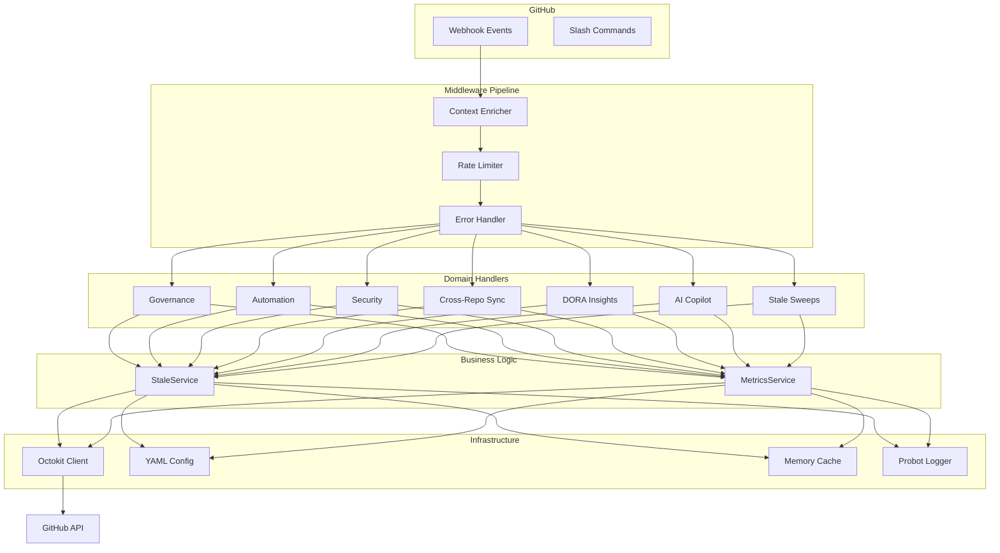

# Architecture Overview

GitBuddy Bot follows **Domain-Driven Design (DDD) with SOLID layers**.

## High-Level Architecture



## Layer Responsibilities

### Core (`src/core/`)

Zero framework dependencies. Contains only abstractions:

- **`interfaces.ts`** — `IEventHandler`, `ILogger`, `IGitHubClient`, `IConfigProvider`, `ICache`, `ICommand`
- **`types.ts`** — `EventContext`, `RepoRef`, `HandlerResult`, `GitBuddyConfig`, `BranchProtection`
- **`errors.ts`** — `AppError` hierarchy: `ConfigError`, `RateLimitError`, `ValidationError`, `GitHubApiError`, etc.

### Infrastructure (`src/infrastructure/`)

Concrete adapters implementing core interfaces:

- **`github/octokit-client.ts`** — `OctokitClient` implements `IGitHubClient` with retry, rate-limit detection
- **`config/yaml-config.ts`** — Reads `.github/gitbuddy.yml` with fallback chain
- **`cache/memory-cache.ts`** — In-memory cache implementing `ICache`
- **`logging/probot-logger.ts`** — Logger adapter for Probot

### Handlers (`src/handlers/`)

Seven domain handlers, each extending `BaseHandler`:

| Handler | Events | Domain |
|---------|--------|--------|
| `governance.handler.ts` | `repository.created`, `branch_protection_rule.*` | Governance |
| `automation.handler.ts` | `issues.opened`, `pull_request.opened` | Automation |
| `security.handler.ts` | `push`, `issues.opened` | Security scanning |
| `stale.handler.ts` | `workflow_run.completed` | Stale sweeps |
| `insights.handler.ts` | `check_run.*`, `deployment_status` | DORA insights |
| `sync.handler.ts` | `push` | Cross-repo sync |
| `copilot.handler.ts` | `pull_request.opened`, `issue_comment.created` | AI copilot |

### Commands (`src/commands/`)

Slash command implementations following the Command Pattern:

- `shipit.command.ts` — `/shipit`
- `label.command.ts` — `/label`
- `triage.command.ts` — `/triage`
- `command-router.ts` — Routes incoming comments to the right command

### Services (`src/services/`)

Pure business logic with no framework dependencies:

- **`stale.service.ts`** — Two-phase stale sweep: mark → close
- Future: metrics service, merge queue service, sync service

### Middleware (`src/middleware/`)

Chain of Responsibility pipeline:

1. **Context Enricher** — Extracts normalized repo/org/sender from raw payload
2. **Rate Limiter** — Per-event-type concurrency cap
3. **Error Handler** — Classifies errors via `AppError` hierarchy, optionally posts to issue

## Key Design Patterns

| Pattern | Where | Why |
|---------|-------|-----|
| **Template Method** | `handlers/base-handler.ts` | Every handler follows: validate → enrich → process → respond |
| **Command** | `commands/*.ts` | Decouples command invocation from execution |
| **Adapter** | `infrastructure/github/octokit-client.ts` | Domain code never imports Octokit directly |
| **Chain of Responsibility** | `middleware/*` | Sequential enrichment, rate limiting, error handling |
| **Composition Root / DI** | `src/index.ts` | Only place concrete implementations are chosen/wired |

## Dependency Flow

```
index.ts (Composition Root)
  └─► Application (app.ts)
       └─► Middleware Chain
            └─► Domain Handlers
                 └─► Services
                      └─► Infrastructure Adapters (via interfaces)
```

All arrows point toward abstractions. Handlers depend on `ILogger` and `IConfigProvider` — never on concrete implementations. Swap an adapter by changing only `src/index.ts`.
