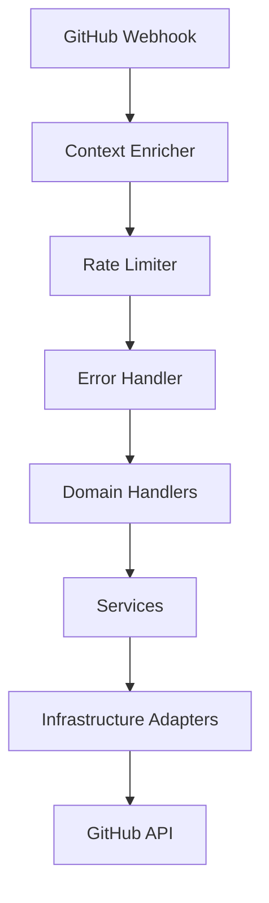

# Introduction

**GitBuddy Bot** is a monolithic [Probot](https://probot.github.io/) GitHub App for org-wide governance, PR/issue automation, security scanning, cross-repo orchestration, DORA insights, and AI copilot integration.

## What GitBuddy Bot Does

GitBuddy Bot automates and enforces best practices across your GitHub organization:

| Domain | Capabilities |
|--------|-------------|
| **Governance** | Auto-bootstrap repos with required files, enforce branch protection, MFA rules |
| **Automation** | Auto-label issues/PRs, enforce PR checklists, manage stale issues |
| **Security** | Secret scanning, PAT age reminders, security alerts |
| **Insights** | DORA metrics collection, CI flakiness detection, weekly digests |
| **Cross-Repo Sync** | Propagate config/source changes to downstream repos |
| **AI Copilot** | PR review, description generation, label suggestion (opt-in) |
| **Slash Commands** | `/shipit`, `/label`, `/triage`, `/merge`, `@gitbuddy summarize` |

## How It Works

1. **Install the GitHub App** on your org or selected repos
2. **Place a `.github/gitbuddy.yml`** config in your org's `.github` repo (or any repo for repo-level config)
3. **GitBuddy Bot listens** to GitHub webhook events and acts according to your config

## Architecture at a Glance

GitBuddy Bot follows **Domain-Driven Design with SOLID layers**:

Read the [Architecture Overview](architecture/overview.md) for a deep dive.

## Getting Help

- **Quick Start** — [5-minute setup](quick-start.md) for a new org
- **Installation** — [Self-hosting guide](installation.md)
- **Configuration** — [Every config option explained](configuration/overview.md)
- **Commands** — [Slash command reference](commands/overview.md)
- **Contributing** — [How to contribute](contributing/setup.md)

## License

MIT — see [LICENSE](https://github.com/shiv-source/gitbuddy-bot/blob/main/LICENSE).
